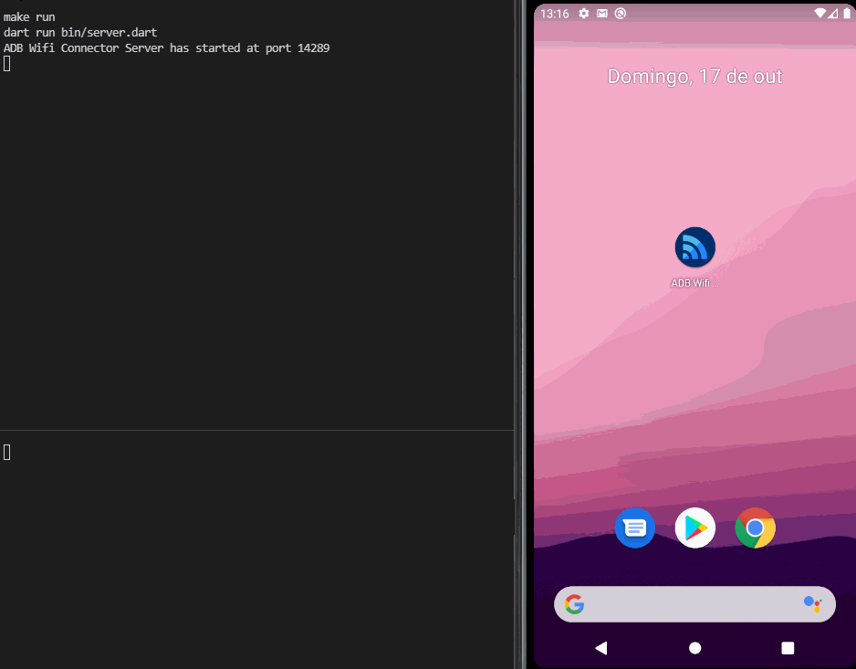

An app used to connect an Android phone to ADB via Wifi.

# Showcase

# How it works
The app connects to servers listening at port 14289 in the current subnet, then verifies if they are ADB Wifi Connector Servers, if so, lists the servers and let the user connect or disconnect to ADB in the hosts.

# Key Flutter features used
- Stateless and Stateful widgets
- Custom themes for color and text
- Pull to refresh list
- Flutter Version Management (FVM)
- State management with [Flutter Triple](https://pub.dev/packages/flutter_triple)
- Functional programming style returns with [FP Dart](https://pub.dev/packages/fpdart)
- Launcher icons with [Flutter Launcher Icons](https://pub.dev/packages/flutter_launcher_icons)

# Architecture
The app is architectured following Clean Architecture principles. It is separated into the following layers:
- Domain: contains the base models, component interfaces and usecases;
- Data: implements the component interfaces;
- Presenter: Implements the UI.

There is also the Core "layer", that implements general use classes.