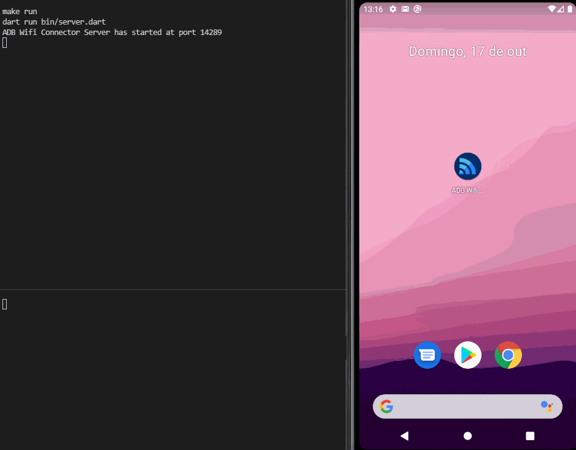

A socket server used to connect an Android phone to ADB via Wifi.

# Showcase

# How it works

The server listens for connections at port 14289, when a client connects it sends a message to the client so that the client knows this is the ADB Wifi Connector Server. 
If the client wants to connect to ADB, it sends a "Connect me" message, the server then runs the command `adb connect $clientIp`. 
If the client wants to disconnect, it sends a "Disconnect me" message, the server then runs the command `adb disconnect $clientIp`. 
If the client wants to know its current status, it sends a "What is my status" message, the server then returns `adb devices` to determine the client status and returns "Connected" or "Disconnected" to the client.

# Key Dart features used
- Socket server
- UTF-8 encoding
- Typedefs
- Futures